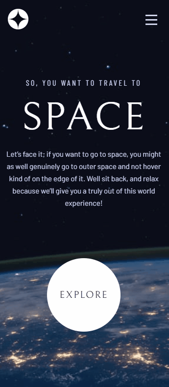

### <div align="center">Choose your language | Escolha seu idioma </div>

<div align="center">

[](https://github.com/edilan-ribeiro/space-tourism/blob/main/README.en.md)
[](https://github.com/edilan-ribeiro/space-tourism/blob/main/README.md) <br>


</div>
<br>
<a name="readme-top"></a>


<br />
<div align="center">
 <a href="https://github.com/edilan-ribeiro/space-tourism">
    
  </a>

<h3 align="center">Space tourism multi-page website</h3>

  <p align="center">
   Frontend mentor challenge "Space tourism"!
  </p>
  
  <a href="https://space-tourism-three-delta.vercel.app/">View Demo</a>
</div>

<br>

<details>
  <summary>Table of Contents</summary>
  <ol>
    <li>
      <a href="#about-the-project">About The Project</a>
      <ul>
        <li><a href="#built-with">Built With</a></li>
        <li><a href="#highlights">highlights</a></li>
        <li><a href="#challenges-and-lessons-learned">Challenges and lessons learned</a></li>
      </ul>
    </li>
    <li><a href="#usage">Usage</a></li>
    <li><a href="#contact">Contact</a></li>
  </ol>
</details>

<br><br>

## About The Project

 

<br><br>

This project is about a website on space tourism!
It contains some pages describing details of how your "journey" through space will be.

<br>


<br>



<p align="right">(<a href="#readme-top">back to top</a>)</p>


### Built With

<div align="center">


</div>


<p align="right">(<a href="#readme-top">back to top</a>)</p>


## Highlights

This page was based on the Frontend Mentor challenge and you can check out the challenge proposal <a href="https://www.frontendmentor.io/challenges/space-tourism-multipage-website-gRWj1URZ3" target="_blank">here</a>.

<p align="right">(<a href="#readme-top">back to top</a>)</p>

## Challenges and lessons learned

🚀 The experience with Next.js was fascinating and challenging, especially when exploring features like the pre-built <Image> component, layout implementation, and the innovation of routing through folder structures.

🎨 Applying Sass and utilizing its variables, mixins, and nesting provided an efficient and modular approach, greatly facilitating code maintenance. The organized structure allowed scalability and smooth adaptation to design changes as the project progressed.

📝 TypeScript: Integrating TypeScript into React/Next.js brought its own nuances. Managing different data types and ensuring consistency in information flow proved to be a valuable learning experience. The static typing provided by TypeScript contributed to early error detection and improved code maintenance.

In summary, it was possible to learn and practice:
 - CSS using SASS
 - React with the framework Next.js
 - Typescript

<p align="right">(<a href="#readme-top">back to top</a>)</p>

## Usage

After cloning, downloading, or forking, use the command below to install the project dependencies:
```shell
npm install
```

This project allows you to:
- Navigate seamlessly between different pages
- Enjoy slide informations
- Use the website across various devices, boasting a responsive design that brings pride in its adaptability and usability across different screen sizes.

<p align="right">(<a href="#readme-top">back to top</a>)</p>

## Contact

💌 To send me a message, just use one of the buttons below!<br>

  <a href = "mailto:edilanbusiness@gmail.com" target="_blank"></a>
  <a href="https://www.linkedin.com/in/edilan-ribeiro-santos" target="_blank"></a> 
  <a href="https://whatsa.me/5561983769634/?t=Hello,%20I%20came%20from%20your%20GitHub!" target="_blank">
  </a>


<p align="right">(<a href="#readme-top">back to top</a>)</p>
